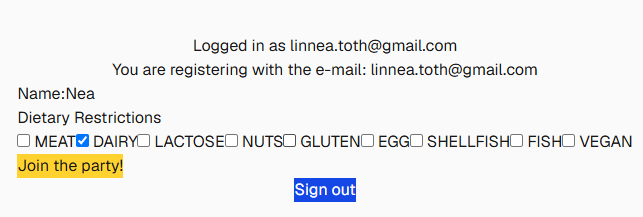
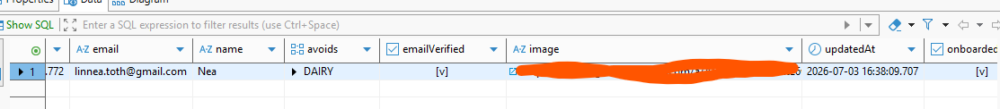
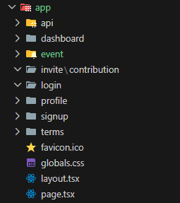
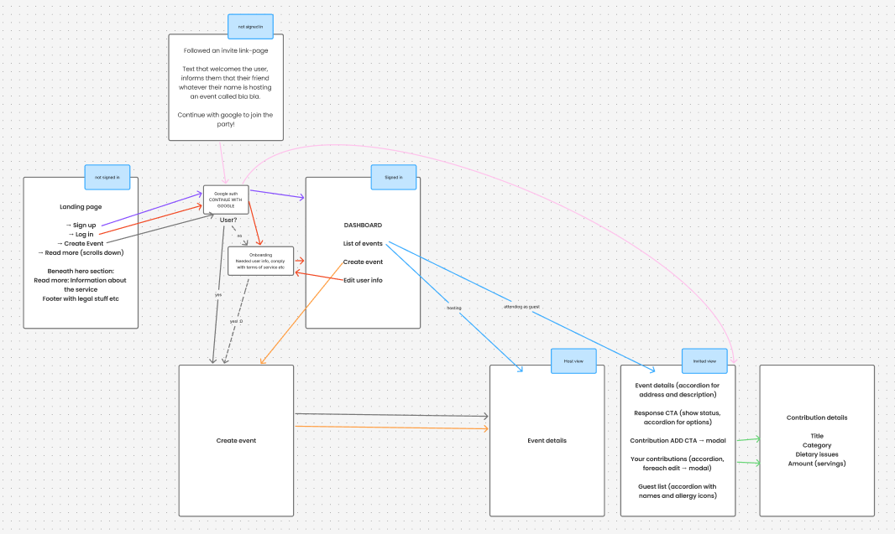
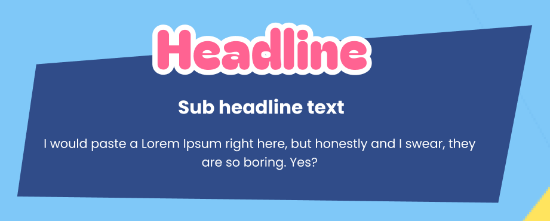
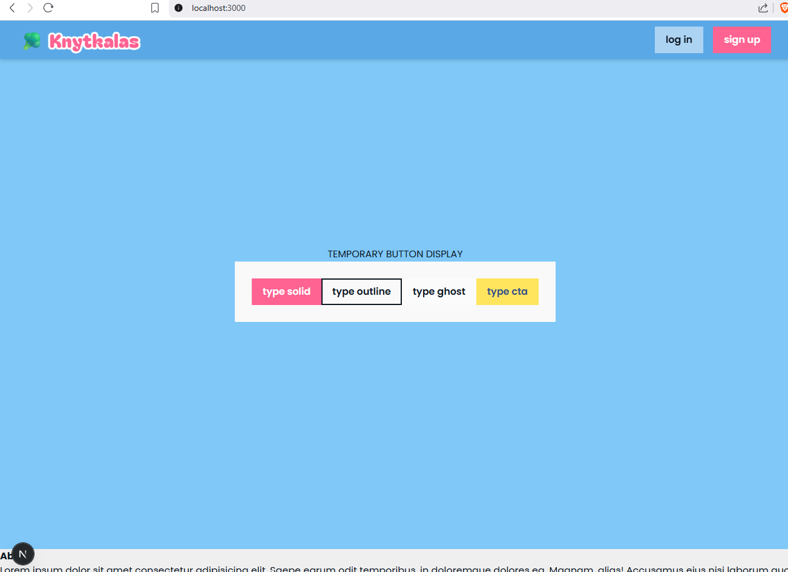
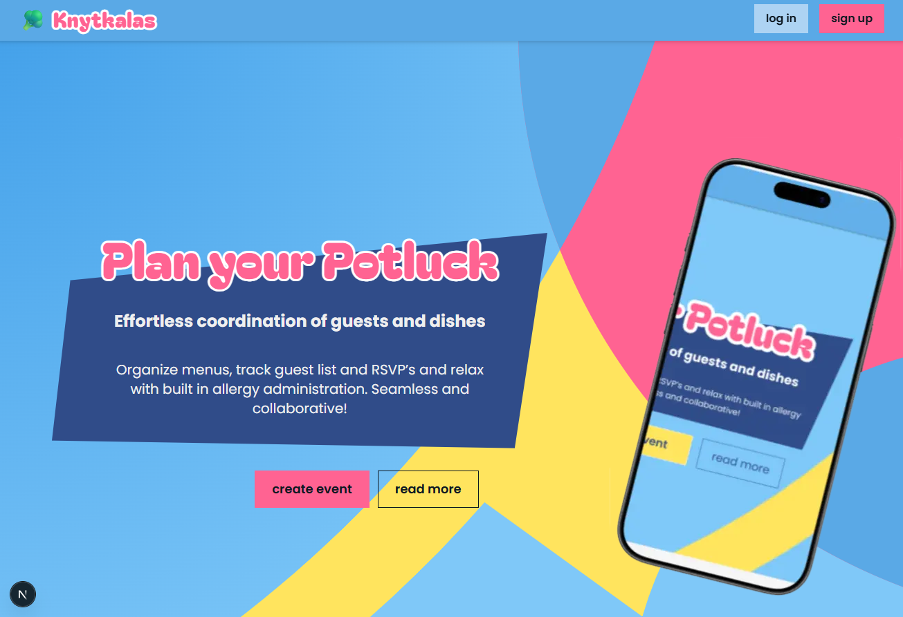
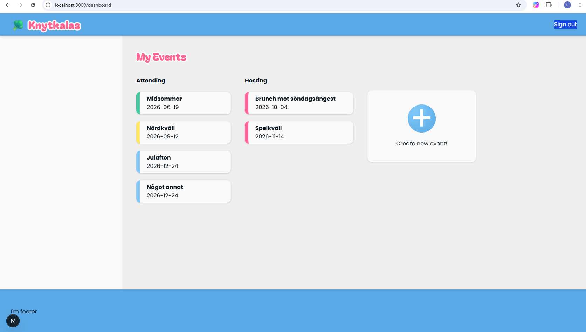
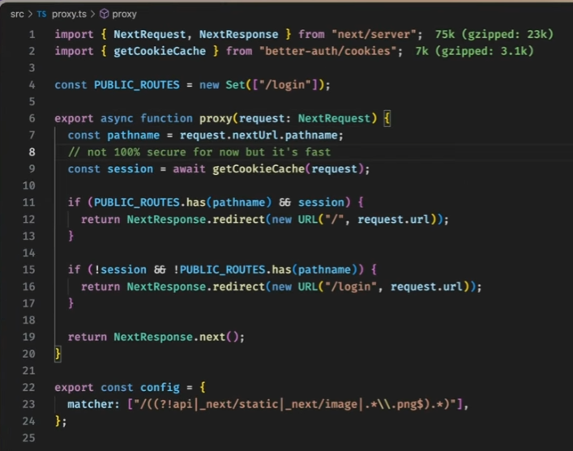

# Log book - Graduation project @ YHB

## [2026-06-15] Course start

Start of course with introduction and instructions received. Subject got clearance: Potluck-fullstack-app with Next.js!

## [2026-06-16] Setup

Scaffolding done. Dev & "admin" setup with repo, tech stack, documents, GitHub Project and other things up and running. Documenting my decisions in my final report as I go, to save time further down the road.

I am looking forward to explore the possibilities with GitHub Projects time charts. So far I have only managed to add a specific date, but I suspect I will be able to add longer time spans, which will be really helpful for visualization. I added my first items to the wrong repository by accident, but since they won't require branching I don't think that will be an issue.

Installed Next.js with the recommended defaults. It comes with the necessary dependencies out of the box, very convenient.

[Next.JS docs - Resource on fetching data with an ORM or db](https://nextjs.org/docs/app/getting-started/fetching-data#with-an-orm-or-database)

Next docs recommend a data access layer. It should only run on the server, perform authorization checks and return DTO's (Data Transfer Objects). I added a data security item to the backlog column, to be adressed when I get there. For now, I will add a data folder to the file structure, where communication with the database will take place.

[Prisma Installation and setup](https://www.prisma.io/docs/guides/frameworks/nextjs)

Installed the required dependencies for prisma (types, client & adapter), and finally Prisma itself.
By initializing Prisma, it creates its own scaffolding with necessary folders and files.

Installed the Prisma extension to VS Code, to add syntax highlighting, formatting, auto-completion, jump-to-definition and linting for .prisma files; which it didn't recognize before.

I "accidentally" went too deep on the database side of things, and began plotting the models. I took note of some Prisma-syntax, where @ signals an attribute and @id indicates the primary key. Through the relation syntax, connections between models is described.@relation("nameIfSeveralRelations", fields: \[nameOftheFieldInThisTable\], references: \[nameOfTheFieldInForeignTable\]).

One thing that is a bit counter intuitive is that Prisma needs a receiving relationship on the table that is references. I have to add an array that lists the incoming references, which in my head collides with the first normal form. As does the enum I added with dietary issues. It can be motivated by the fact that it is scoped to the issues I added to the enum definition, and is not cross referenced to a table with it's own data.

Seems like the last dependency I can currently see that I will need in the future is something for authentication. [NextAuth.js](https://next-auth.js.org/getting-started/introduction) offers a lot of built-in functionality. What I currently care about is that it will play well with Next, and allow me to use google for authentication. I installed it and initialized it using [this tutorial](https://next-auth.js.org/configuration/initialization#route-handlers-app). And I discover that this is the old version and that there is a [newer version](https://better-auth.com/) in town. Redid the installation and setup, based on the [Better-Auth documentation](https://better-auth.com/docs/installation).

During the afternoon, I spent some time in Figma.

| Color scheme                                                                                                                                                                                                                                                                         | First sketch of visual expression                                                                                                                                                                                                                                                                                   |
| ------------------------------------------------------------------------------------------------------------------------------------------------------------------------------------------------------------------------------------------------------------------------------------ | ------------------------------------------------------------------------------------------------------------------------------------------------------------------------------------------------------------------------------------------------------------------------------------------------------------------- |
|                                                                                                                                                                                                                                                          |                                                                                                                                                                                                                                                                                  |
| I am after a colorful and friendly expression, with parallels to the whimsical combinations one can expect at a true potluck event. This color palette, I feel, I can tone down if needed (shades of blue, nothing but calming), and throw in energizing accents wherever I want to. | I made a sketch of a landing page to get a feel for what it might be. I like the abstract geometries and the dynamics it brings. I plan on adding some visual elements to the left, food items in green line art (that might move, gently, on scroll). The phone will display a visual sneak peek of an event view. |

## [2026-06-17] More foundations

I spent some time during the morning on looking at available domains. I was close to purchasing knytis.net, but discovered a Lovable app on knytis.app that actually does something similar to what I am planning. I will obviously hand craft _this_ app to my own liking, but I might revert back to knytkalas.

As of 09:45 [knytkalas.net](http://www.knytkalas.net) is mine!

I plan to host the thing at home, later, and found that NameCheap (where I bought the domain, because.. well, cheap) had some limitations. No SSL-certificate (people would get warnings if they tried to go to https://www.knytkalas.net), for instance. I created a free Cloudflare account and got that, including instant DNS-updates (for when I want to redirect the traffic somewhere) and according to them some security features. I connected the domain, and changed the nameservers so that Cloudflare handles the traffic from now on. Redirected it to a temporary placeholder at github pages, for now. I had Gemini answer a lot of questions for me during this process, which helped me understand some of which was new to me.

With that distraction out of the way, it was back to focusing on the scaffolding of the app flow, using Figma to draw out a sketchy flow chart.

**To forego scope creep, I defined my MVP SCOPE:**
Landing page. Google auth (signup/login). User details added on signup, including dietary profile. Dashboard listing events the user hosts or is invited to. Create/edit event (occasion, date, location, description, host-selected contribution categories, contribution deadline). Shareable invite links → invite landing page. Event details page (host and guest variants). RSVP with editable status. Guests add/edit/remove their own contributions within open categories, each tagged with dietary flags. Dietary issues shown for both users and contributions, with a filter to see what's safe to eat.

Created a local postgreSQL db for dev, and managed to connect it to Prisma with guidance from their docs (I basically just followed their instructiosn step by step). The new tables confirm that the migration worked.

I developed my data schema. Lastly I ran the Better Auth CLI to generate its required models (Session, Account, Verification), which also added fields to User. I ran into a Prisma 7 vs pnpm bug, but I got some help by Claude to scan the web for solutions and resolved it by adding the package with prismas client runtime utils as an explicit dependency.

Next time I merge a branch into main I'll try to remember to use --squash for a cleaner history. And with that, this day is officially over.

## [2026-06-18]

I followed [Better-Auth's documentation for authentication with google](https://better-auth.com/docs/authentication/google). First thing this morning, I created a project over at [console.cloud.google.com](console.cloud.google.com). From there, I set up the credentials as per Better-Auth's instructions. Auth isn't open for anybody, until the app is published and later approved. For now, I have a added list of test users from my family, who will be able to use the service.

One of the scripts I ran during installation introduced a src/lib folder for prisma.ts. I moved prisma.ts to utils, to clean up the architecture and adhere to the "everything in root" structure I got from installing next.

I have yet to decide how I organize my components in this app. Next time I will read up on architecture best practices in Next.

For now, there is a one tap button that works with Google authentication. It triggers their own modal, where the user is prompted to select an account.

And the startup-phase of my project is a wrap!

## [2026-07-02]

New "sprint", or phase, initiated! **User is able to sign in with their google account, and sign out. If user doesn't exist, a new user can be created**

I found an hour or two, and decided to spend it on architectural decisions. I consulted with [Next docs on project structure](https://nextjs.org/docs/app/getting-started/project-structure), and asked what Claude had to say in the matter.

I refreshed my memory on Next's app routing, and how components can be safely colocated without initiating routes. However, I prefer the cleaner separation, where the app folder is solely for routing purposes. For this project, I decide on a feature driven architecture.

Components: Shared UI components  
Features: Feature modules  
Utils: Core utilities  
Types: Global types

Each feature will be structured as follows:

- Components
- Hooks
- Services
- Types

I read something about explicit exports through multiple index.ts files. It seems interesting, but I decided against spending time on pursuing that.

I also [need to add a route for Better Auth integration](https://better-auth.com/docs/integrations/next).

To do this, I create a route file inside `/api/auth/[...all]`

The rest of the setup, I have already done, it seems. I got some errors with the generic one tap button. After a lot of troubleshooting, I resorted to creating my own login buttons (which I am going to prefer anyway; and googles errors are gone from my console!). Auth now works!

(Daily annoyance: Apparently Google has deprecated the individual access to Gemini Code Assist. If I want to keep using it, I need to migrate to their own Antigravity IDE.)

## [2026-07-03]

The better auth useSession() hook I used yesterday, for a temporary component verifying that the Google authentication works, is client side only, and hence breaks the [data access layer (DAL) pattern](https://nextjs.org/docs/app/guides/data-security#data-access-layer) I am going for.

The [better-auth docs describe what I believe is the server equivalence, the auth API](https://better-auth.com/docs/concepts/api).

I need to juggle some concepts here, simultaneously reading up on [CRUD with Prisma](https://www.prisma.io/docs/orm/prisma-client/queries/crud).

Even though all components are serverside by default, explicit "server-only" is added to everything in the Data Access Layer, to prevent Next from bundling and exposing it with client side code.

Since Prisma and its adapter automatically points to my User table, Better Auth automatically adds a User row when someone authenticates themselves. I have no way of telling if they have done the onboarding, declaring allergies etc, so I add a bool ("onboarded") that defaults to false to the schema.

Worked on getUser, getSessionUserId and onboardUser (create user, but creation is technically done as soon as someone verifies their identity with google).

Claude gave me a nice quote, during one of our tutoring sessions: "Don't return what nothing consumes". Would make for a great embroidery above my workstation.

I wrap up the day with a hint of functionality in the sign up process. User verifies themselves with their google account, a row in User table is added. They fill in their details in a form, which is then updated in the database.

  

client form → typed FormData extraction → Server Action with validated enum values → DAL update

Next time, I will add logic to the issue management. If they indicate that they don't eat dairy at all, lactose should be crossed out as well. Same goes for vegans and everything animal based.

## [2026-07-04]

Didn't have much time to spend on code today, but I managed to add an utility function for formatting dietary issues as described above, and mapped my theme colors to global variables.

**WCAG CHECK**
FG #0D1821 /BG #EFEFEF - AAA
FG #0D1821 /Card BG #F9F9F9 - AAA
FG #0D1821/ Primary #7FC8F8 - AAA
FG #0D1821/ secondary #FF6392 - AAA
FG #304C89 / accent #FFE45E - AA (on normal text, AAA on large)
FG #0D1821/ success #40C9A2 - AAA

## [2026-07-06]

(4h + 2h)

String up the routing in the app folder and am rethinking my original modal ideas. They get messy on mobile, and focuse wise certain steps would benefit from having a dedicated page.

This will likely, of course, be developed along the road, but here is my foundation as of today:

Poppins is everywhere, and I debated whether adding to the overuse of the. However, it is clean with nice geometries, reads friendly and clear. It stays. For featured headlines, "Bagel fat one" is what ignites the party.

The next/font module is already in place with /google, so all I need to do is to add my fonts to the import in the root layout, and update the globals.css.

I have heard a lot of good things about shadcn, and have decided to try it. Here goes.
`pnpm dlx shadcn@latest add button`

Strategic or not, did a 180 and decided otherwise. I'm fine with good old Tailwind and CSS. There are enough new concepts and abstractions to deal with in this project.

Spent some time on a button component, with four types and three different sizes.

Since we are allowed to use AI in this project, I am cautiously looking for a balance between having it help me while not diminishing my joy in the craft and ownership in this. One example is when I had an issue with outlining my "Knytkalas" text in the header. It came up with an overlay strategy, and handed me functioning code for that.

My strategy now that I have a foundation, is to work through my project following the flow chart. I'm currently at the landing page. I will not wait for it to be refined, but I want the functionality and outlines of it to be in place before moving on.

I am trying to wrap my head aroun whether I need global state. In that regard, fullstack Next is not like frontend React. I can safely access my DAL from server components.

Found a couple of hours in the evening. Added missing pages to links from landing page. Tweaked stuff to make navigation between the diffent routes work, as well as very rudimentary styling. Added pattern SVG export from Affinity as hero background.

## [2026-07-07]

(3h +1h)

Refined the "move to the top of the home page" functionality of the logo, by moving it to an invididual component, "use client" and make use of the window element. I still have an anchor page on "about" which looks a bit messy in the URL, it is not in the top of my backlog but it is there.

Kept working on the landing page. Spent some time on stacking order and a switch fallthroug-bug. I have a very crude landing page now, which obviously needs refinement. I will leave it as is, for now, while I focus on scaffolding the rest of the app and its functionality.

Worked on the redirects. To avoid people introducing absolute redirects to other places through my auth, I wrote a little util that validates paths. I spent some time chatting with both Claude and Gemini on the design and functionality of this.

## [2026-07-08]

(2.5h + 1.5h + 2h)

Today, I tackled the previously non-existing dashboard. Created UI components and some utils, working with mock data. Layout itself is scaffolded with tailwind grid + flex. Still a lot of tweaking to be done with the UI, but I'm aiming for a functional app before polishing. No responsiveness in place whatsoever. Next step is setting up some services.

I forgot about the scope I had set for this particular branch, and happened to do some off topic work in "signup-login". Worth noticing and correcting in future work, however as I am soloing this it doesn't really matter past the slight annoyance.

In my previous projects, where I have worked with databases and backends, I set up scripts for seeding mock data in a db. This time I took the shortcut of adding some stuff manually to the events table through DBeaver's GUI.

So where are we, now.. There is a skeleton for a landing page; same goes for dashboard. Needs work and refinement, but we have something. Dashboard loads signed in user's own hosted events. Events attending are still just placeholders. Sign in and sign up with google works!

And, a git win, I did remember to squash during merge this time 😁

## [2026-07-09]

CRUD for events. Not as straight forward as I first thought. What, delete, done. Right? No. Cascading deletes? Stale references? FK errors from Prisma? What happens on the guest's side? Do their invites just disappear? Or does the UI reflect that the event has been cancelled? Brilliant idea, just deactivate it! But storage..? I'm in deep water. I put all of this into Claude, which helped me sort my thoughts. In the end, it was simple as adding an optional field to the Event schema: deletedAt DateTime? ✅

`npx prisma migrate dev --name add_event_deleted_at` for migration
(also had to rebuild the prisma client, always forget that and have to look it up!)

`pnpm add lucide-react` Added open sourced Lucide for icons.

This is the first full stack app I build from scratch in Next, and I'm learning while I go along. Tried to come up with more ways to utilize AI, and asked Claude how well my project utilizes Next:

> What's working well
>
> - Real Server Components throughout — app/layout.tsx is async and fetches session data directly server-side, no unnecessary client wrapper.
> - next/font/google wired properly via CSS variables (self-hosted fonts, no layout shift).
> - next/image in use for the hero.
> - Server Actions ("use server") genuinely used for getCurrentUser, onboard, etc. — not faked via API routes, which is the idiomatic Next 16 way to do mutations.
> - Custom not-found.tsx.
>
> Missing — natural fits you haven't reached for yet
>
> - No middleware.ts anywhere. Your login redirect (useAuthRedirect.ts) is entirely client-side: "use client" → useEffect → fetch user → router.push. That means the page renders once, then redirects — a visible flash. Middleware runs before the page renders at all, so an unauthenticated user gets redirected server-side with no flash. This is the single highest-value gap to close.
> - No loading.tsx / error.tsx / Suspense anywhere. Riust blocks the whole page with nothing shown. Theseare file-based in App Router — dropping a loading.tsx next to a page.tsx is close to free.
> - No per-page metadata. Only the root layout sets a title, so /dashboard, /login, etc. all share one browser-tab title.
> - No revalidation strategy (revalidatePath/revalidatorth knowing about once you have mutations thatshould refresh cached data.
>
> One thing actively fighting Next conventions
>
> - Duplicate DB round-trips: app/layout.tsx calls getSessionUserId(), and getHostedEvents() (used separately on the dashboard page) calls it again. fetch() gets automatic per-request dma calls don't — so this is two real session lookupsper page load instead of one. Wrapping those DAL functions in React's cache() fixes it without restructuring anything.
>
> If you want the highest leverage for least effort, iuth redirect → loading.tsx on dashboard/event pages → cache() around the session lookups.

I will _definitely_ adjust my redirects with middleware to avoid clunky reloads. Straight to the backlog. So is suspense for layout while loading, but most UI refinement is deliberately kepts for last. Priority is a working app. Caching only took an import and method call, so that I did immediately.

So regarding middleware, docs tell me the middleware file convention in Next is deprecated and is now handled through proxy.js - which is more or less the same thing? [Spent some time with the docs](https://nextjs.org/docs/app/getting-started/proxy).

[This video on Youtube](https://www.youtube.com/watch?v=QKzWMdve6oY) gave me some takeaways:

- No auth in proxy
- Multiple execution contexts in Next -> cannot have middleware in the middle of the "chaos"
- Use it only for routing
- Use react cache() to lessen the impact of calling a lot of functions from the DAL

Also, the video offered a solution with better auth. I'll look into what I can recycle from that.

I ran into the advertised issue of multiple execution context.

[A lot of "spike time" today. Read up on session management among other things.](https://better-auth.com/docs/concepts/session-management).

Server components are receiving searchParams automatically as props!

I will surely need a lot of time to digest all this, but I can wrap up the day with gated routes in proxy.ts, which helped reduce the redirect logic I had in place (needless having the components mount and render, only to forward the user somewhere else).

Got to close my next not-timeboxed-"sprint", "login/signup, landingpage exists". Good thing I deviated from the event CRUD plan I had for today, that will make for a great next chapter along with the rest of the CRUD-functionality I need!

## [2026-07-10]

(7h)

I love discovering little "gifts" here and there, in the frameworks and libraries I use. I struggle with something, and suddenly receive a gem of a tool that solves it! Today I am grateful for Prisma's different automatic types.

Powered through most of the DAL functionality for CRUD of users, events and invites. Haven't touched contributions yet.

Will implement the currently supported functions in the dashboard first.

Also, If I have time I have plans for the UI. Going for a completely different look.

Reorganised my dashboard routing, by moving event to a subroute. Moved some UI to a layout.tsx which subroutes will inherit. Looked into dynamic routing in next docs, doesn't look too intimidating. Made one for events based on id. Services check if people have a role at the event, before getting the details from DAL and passing them to the page. Spent quite some time on bug hunts.

Some planning:
When host invites, they write a name of their own for the recipient and get a shareable token. As soon as the invitee signs in from that, the name is replaced with whatever they have in their account. That way, the event will have a list of invited people as well as their status
In the future, the app should probably have a friend/messaging feature and/or something elaborate, but this should work for now.

2do, update the Schema with a name field:

model Invite {
...
guestName String // host-written placeholder, e.g. "Cousin Bob"
guestId String? // set once they sign in
guest User? @relation(...)
}

When I get back from another week off, I recommend myself to start with reading all of the data to the event details page and add some functionality for the host. Send invites. Edit. Delete. And so on. Goodness I have a lot to implement. Good thing that's a problem for later. Cheers! 🌞
