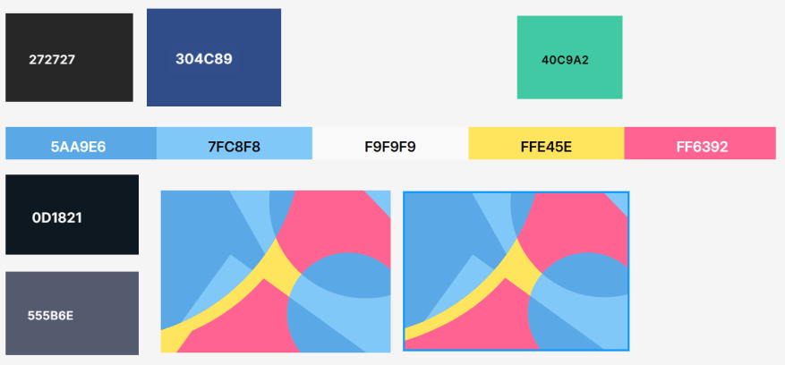
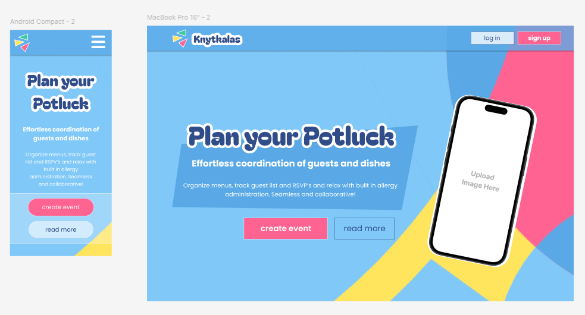
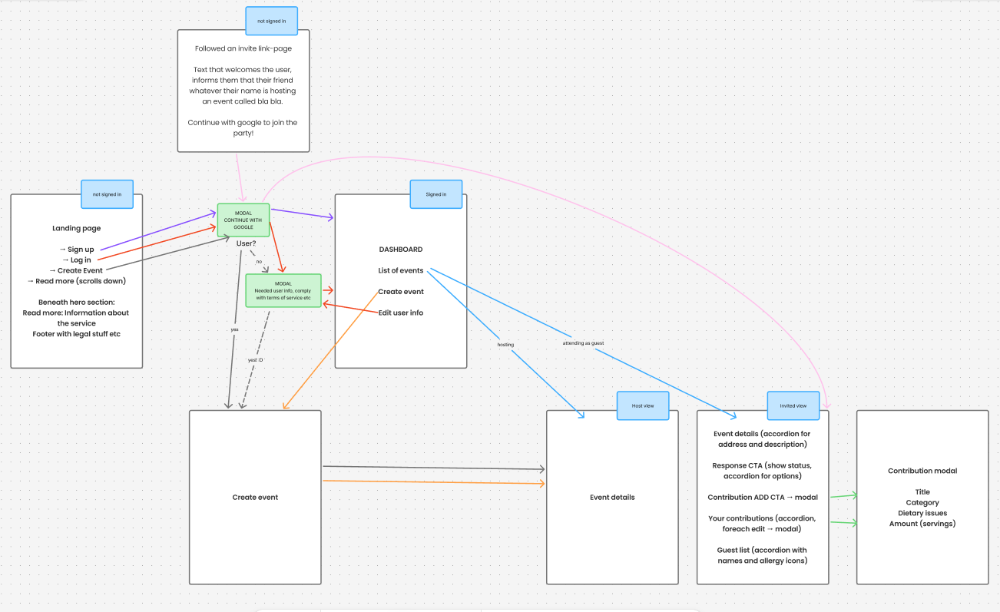
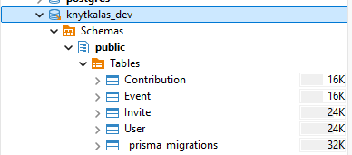
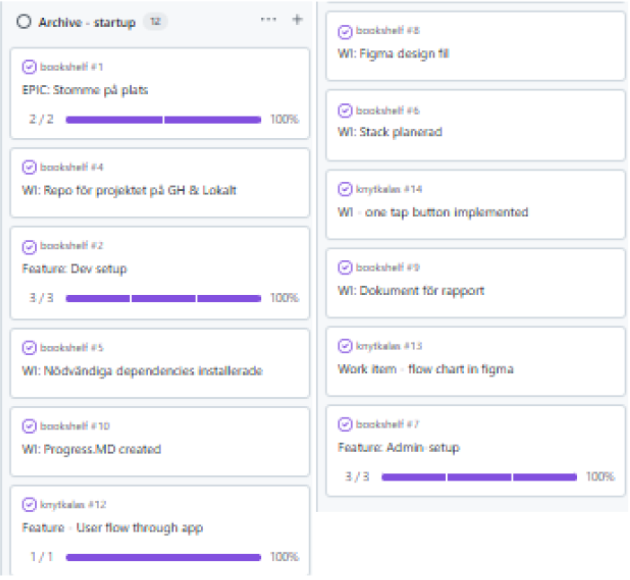
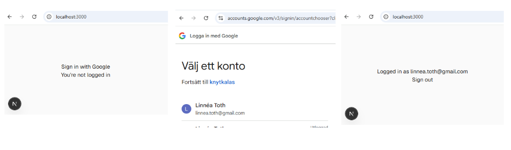

# Log book - Graduation project @ YHB

## [2026-06-15] Course start

Start of course with introduction and instructions received. Subject got clearance: Potluck-fullstack-app with Next.js!

## [2026-06-16] Setup

Scaffolding done. Dev & "admin" setup with repo, tech stack, documents, GitHub Project and other things up and running. Documenting my decisions in my final report as I go, to save time further down the road.

I am looking forward to explore the possibilities with GitHub Projects time charts. So far I have only managed to add a specific date, but I suspect I will be able to add longer time spans, which will be really helpful for visualization. I added my first items to the wrong repository by accident, but since they won't require branching I don't think that will be an issue.

Installed Next.js with the recommended defaults. It comes with the necessary dependencies out of the box, very convenient.

[Next.JS docs - Resource on fetching data with an ORM or db](https://nextjs.org/docs/app/getting-started/fetching-data#with-an-orm-or-database)

Next docs recommend a data access layer. It should only run on the server, perform authorization checks and return DTO's (Data Transfer Objects). I added a data security item to the backlog column, to be adressed when I get there. For now, I will add a data folder to the file structure, where communication with the database will take place.

[Prisma Installation and setup](https://www.prisma.io/docs/guides/frameworks/nextjs)

Installed the required dependencies for prisma (types, client & adapter), and finally Prisma itself.
By initializing Prisma, it creates its own scaffolding with necessary folders and files.

Installed the Prisma extension to VS Code, to add syntax highlighting, formatting, auto-completion, jump-to-definition and linting for .prisma files; which it didn't recognize before.

I "accidentally" went too deep on the database side of things, and began plotting the models. I took note of some Prisma-syntax, where @ signals an attribute and @id indicates the primary key. Through the relation syntax, connections between models is described.@relation("nameIfSeveralRelations", fields: \[nameOftheFieldInThisTable\], references: \[nameOfTheFieldInForeignTable\]).

One thing that is a bit counter intuitive is that Prisma needs a receiving relationship on the table that is references. I have to add an array that lists the incoming references, which in my head collides with the first normal form. As does the enum I added with dietary issues. It can be motivated by the fact that it is scoped to the issues I added to the enum definition, and is not cross referenced to a table with it's own data.

Seems like the last dependency I can currently see that I will need in the future is something for authentication. [NextAuth.js](https://next-auth.js.org/getting-started/introduction) offers a lot of built-in functionality. What I currently care about is that it will play well with Next, and allow me to use google for authentication. I installed it and initialized it using [this tutorial](https://next-auth.js.org/configuration/initialization#route-handlers-app). And I discover that this is the old version and that there is a [newer version](https://better-auth.com/) in town. Redid the installation and setup, based on the [Better-Auth documentation](https://better-auth.com/docs/installation).

During the afternoon, I spent some time in Figma.

| Color scheme                                                                                                                                                                                                                                                                         | First sketch of visual expression                                                                                                                                                                                                                                                                                   |
| ------------------------------------------------------------------------------------------------------------------------------------------------------------------------------------------------------------------------------------------------------------------------------------ | ------------------------------------------------------------------------------------------------------------------------------------------------------------------------------------------------------------------------------------------------------------------------------------------------------------------- |
|                                                                                                                                                                                                                                                          |                                                                                                                                                                                                                                                                                  |
| I am after a colorful and friendly expression, with parallels to the whimsical combinations one can expect at a true potluck event. This color palette, I feel, I can tone down if needed (shades of blue, nothing but calming), and throw in energizing accents wherever I want to. | I made a sketch of a landing page to get a feel for what it might be. I like the abstract geometries and the dynamics it brings. I plan on adding some visual elements to the left, food items in green line art (that might move, gently, on scroll). The phone will display a visual sneak peek of an event view. |

## [2026-06-17] More foundations

I spent some time during the morning on looking at available domains. I was close to purchasing knytis.net, but discovered a Lovable app on knytis.app that actually does something similar to what I am planning. I will obviously hand craft _this_ app to my own liking, but I might revert back to knytkalas.

As of 09:45 [knytkalas.net](http://www.knytkalas.net) is mine!

I plan to host the thing at home, later, and found that NameCheap (where I bought the domain, because.. well, cheap) had some limitations. No SSL-certificate (people would get warnings if they tried to go to https://www.knytkalas.net), for instance. I created a free Cloudflare account and got that, including instant DNS-updates (for when I want to redirect the traffic somewhere) and according to them some security features. I connected the domain, and changed the nameservers so that Cloudflare handles the traffic from now on. Redirected it to a temporary placeholder at github pages, for now. I had Gemini answer a lot of questions for me during this process, which helped me understand some of which was new to me.

With that distraction out of the way, it was back to focusing on the scaffolding of the app flow, using Figma to draw out a sketchy flow chart.

**To forego scope creep, I defined my MVP SCOPE:**
Landing page. Google auth (signup/login). User details added on signup, including dietary profile. Dashboard listing events the user hosts or is invited to. Create/edit event (occasion, date, location, description, host-selected contribution categories, contribution deadline). Shareable invite links → invite landing page. Event details page (host and guest variants). RSVP with editable status. Guests add/edit/remove their own contributions within open categories, each tagged with dietary flags. Dietary issues shown for both users and contributions, with a filter to see what's safe to eat.

Created a local postgreSQL db for dev, and managed to connect it to Prisma with guidance from their docs (I basically just followed their instructiosn step by step). The new tables confirm that the migration worked.

I developed my data schema. Lastly I ran the Better Auth CLI to generate its required models (Session, Account, Verification), which also added fields to User. I ran into a Prisma 7 vs pnpm bug, but I got some help by Claude to scan the web for solutions and resolved it by adding the package with prismas client runtime utils as an explicit dependency.

Next time I merge a branch into main I'll try to remember to use --squash for a cleaner history. And with that, this day is officially over.

## [2026-06-18]

I followed [Better-Auth's documentation for authentication with google](https://better-auth.com/docs/authentication/google). First thing this morning, I created a project over at [console.cloud.google.com](console.cloud.google.com). From there, I set up the credentials as per Better-Auth's instructions. Auth isn't open for anybody, until the app is published and later approved. For now, I have a added list of test users from my family, who will be able to use the service.

One of the scripts I ran during installation introduced a src/lib folder for prisma.ts. I moved prisma.ts to utils, to clean up the architecture and adhere to the "everything in root" structure I got from installing next.

I have yet to decide how I organize my components in this app. Next time I will read up on architecture best practices in Next.

For now, there is a one tap button that works with Google authentication. It triggers their own modal, where the user is prompted to select an account.

And the startup-phase of my project is a wrap!

## [2026-07-02]

New "sprint", or phase, initiated! **User is able to sign in with their google account, and sign out. If user doesn't exist, a new user can be created**

I found an hour or two, and decided to spend it on architectural decisions. I consulted with [Next docs on project structure](https://nextjs.org/docs/app/getting-started/project-structure), and asked what Claude had to say in the matter.

I refreshed my memory on Next's app routing, and how components can be safely colocated without initiating routes. However, I prefer the cleaner separation, where the app folder is solely for routing purposes. For this project, I decide on a feature driven architecture.

Components: Shared UI components  
Features: Feature modules  
Utils: Core utilities  
Types: Global types

Each feature will be structured as follows:

- Components
- Hooks
- Services
- Types

I read something about explicit exports through multiple index.ts files. It seems interesting, but I decided against spending time on pursuing that.

I also [need to add a route for Better Auth integration](https://better-auth.com/docs/integrations/next).

To do this, I create a route file inside `/api/auth/[...all]`

The rest of the setup, I have already done, it seems. I got some errors with the generic one tap button. After a lot of troubleshooting, I resorted to creating my own login buttons (which I am going to prefer anyway; and googles errors are gone from my console!). Auth now works!

(Daily annoyance: Apparently Google has deprecated the individual access to Gemini Code Assist. If I want to keep using it, I need to migrate to their own Antigravity IDE.)

## [2026-07-03]

The better auth useSession() hook I used yesterday, for a temporary component verifying that the Google authentication works, is client side only, and hence breaks the [data access layer (DAL) pattern](https://nextjs.org/docs/app/guides/data-security#data-access-layer) I am going for.

The [better-auth docs describe what I believe is the server equivalence, the auth API](https://better-auth.com/docs/concepts/api).

I need to juggle some concepts here, simultaneously reading up on [CRUD with Prisma](https://www.prisma.io/docs/orm/prisma-client/queries/crud).

Even though all components are serverside by default, explicit "server-only" is added to everything in the Data Access Layer, to prevent Next from bundling and exposing it with client side code.

Since Prisma and its adapter automatically points to my User table, Better Auth automatically adds a User row when someone authenticates themselves. I have no way of telling if they have done the onboarding, declaring allergies etc, so I add a bool ("onboarded") that defaults to false to the schema.

Next time I open this project, I will continue working on getCurrentUser.ts:

Check if there is currently a user at all. If there is a user, use their ID from better auth to get their data from DB (since better auth only stores and shows core fields, not the ones particularly relevant to my project.)

Curate the data and only return what the app might need. Make certain to pay attention to if the person is onboarded or not. If the user needs onboarding: minimal info (id, email), if already onboarded: full profile (avoids, events and invites etc)
